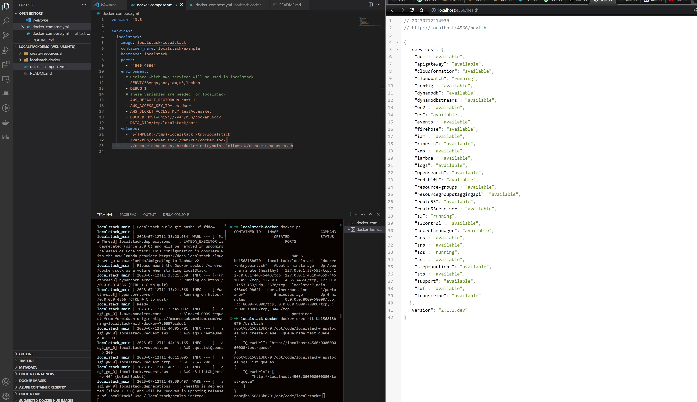
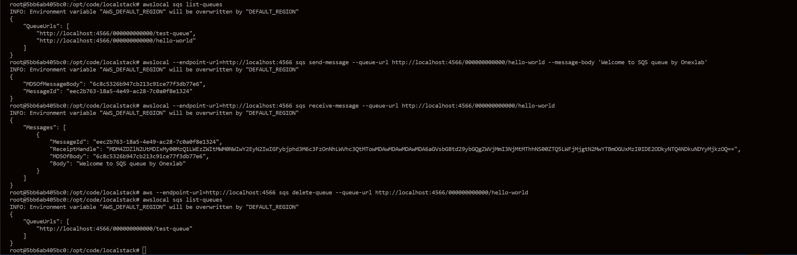
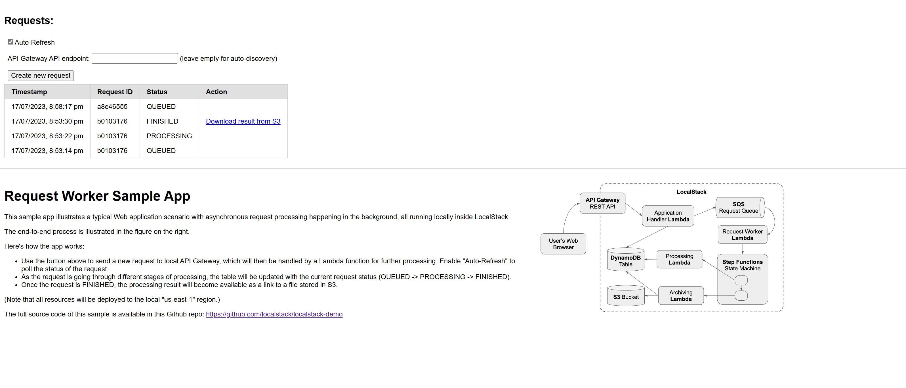
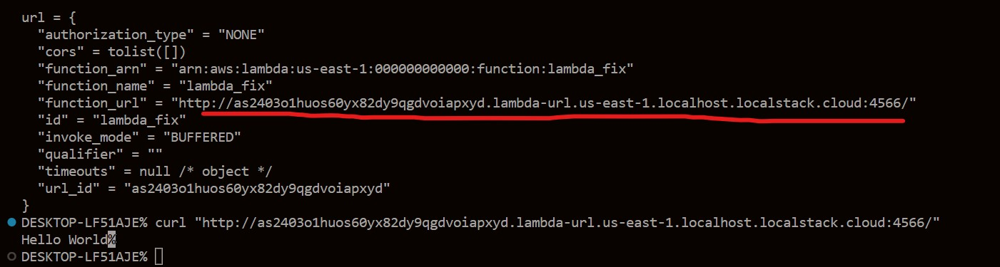
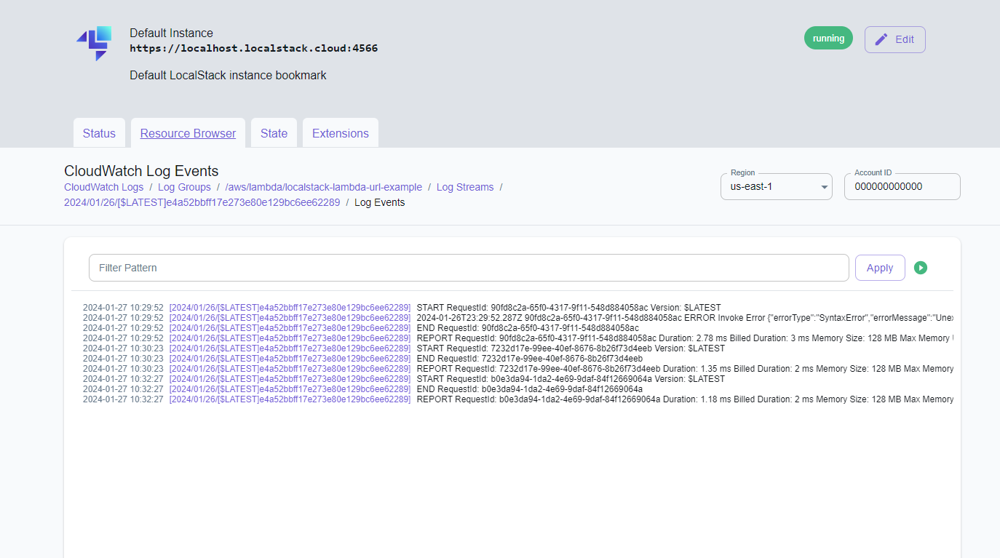

# Localstack Demo

## Localstack Docker

```javascript
## clean up docker https://www.freecodecamp.org/news/how-to-remove-all-docker-images-a-docker-cleanup-guide/

# install localstack in docker
https://docs.fuga.cloud/how-to-install-portainer-docker-ui-manager-on-ubuntu-20.04-18.04-16.04

$ docker-compose up

$ docker ps

$ docker exec -it id_container /bin/bash

# aws cli  local https://github.com/localstack/awscli-local


$ awslocal sqs create-queue --queue-name test-queue

$ awslocal sqs list-queues

# health check
http://localhost:4566/health

```



## Localstack-docker1

```javascript
$ sudo service docker status

$ sudo service docker start

$ sudo service docker stop

$ docker-compose up -d

$ docker ps -a

$ docker exec -it id_container /bin/bash

# crud sqs

# stop and remove the container
$ docker compose down
```



## nx lambda function

```javascript
# docker desktop => extensions => localstack => install => start => pull localstack

$ npx create-nx-workspace@latest my-functions --preset=@nx/aws-lambda

$ pip install aws-sam-cli-local

$ pip install terraform-local


```

## localstack-demo

```javascript
# https://github.com/localstack/localstack-demo.git

$ make usage

$ make install

$ make deploy

# surf http://localhost:4566/archive-bucket/index.html

#add python to zsh
$ echo "alias python=/usr/bin/python3" >> ~/.zshrc

```



## terraform-demo

```javascript
$ pip install terraform-local

$ pip install awscli-local
```

## terraform-demo2

```javascript
$ tflocal init

$ tflocal plan

$ tflocal apply
```

## terraform-lambda-demo

```javascript
# start localstack on docker
$ sudo service docker start

# localstack health check http://localhost:4566/health

$ terraform init

$ terraform plan

$ terraform apply --auto-approve
```




## localstack best practice

UI

## Tech Stack

- [x] Docker
- [x] Aws Cli
- [x] LocalStack
- [x] Lambda
- [x] CloudWatch



`````javascript

# go to ui/nodejs-aws-lambda path
cd ./ui/nodejs-aws-lambda

# download windows version
localstack
# set env path for localstack.exe

# open docker desktop

# docker compose
$ docker-compose up

# health check
$ http://localhost:4566/_localstack/health

# start
$ localstack start -d

# status
$ localstack status services

# dashboard
https://app.localstack.cloud/dashboard


# aws sam cli
$ sam init

$ Compress-Archive index.js function.zip

$ cd ~/.aws
$ notepad config
$ notepad credentials


$ set AWS_PROFILE=localstack

# list all the configurations 
$ aws configure list

$ aws --endpoint-url=http://localhost:4566 lambda create-function --function-name localstack-lambda-url-example --runtime nodejs18.x --zip-file fileb://function.zip --handler index.handler --role arn:aws:iam::000000000000:role/lambda-role 

$ aws --endpoint-url=http://localhost:4566 lambda create-function-url-config --function-name localstack-lambda-url-example --auth-type NONE

{
    "FunctionUrl": "http://q2sjdn73gxfjxz86qp3qchq9ljmp04qm.lambda-url.us-east-1.localhost.localstack.cloud:4566/",
    "FunctionArn": "arn:aws:lambda:us-east-1:000000000000:function:localstack-lambda-url-example",
    "AuthType": "NONE",
    "CreationTime": "2024-01-25T12:36:37.977616+0000"
}

# run in restclient for below curl instead

# change to xxxx.lambda-url base on command runs above
$ curl -X POST "http://q2sjdn73gxfjxz86qp3qchq9ljmp04qm.lambda-url.us-east-1.localhost.localstack.cloud:4566/" -H "Content-Type: application/json" -d '{"num1": "10", "num2": "10"}'


logs describe-log-streams --log-group-name /aws/lambda/serverless-local-hello


# .net lambda function
// install AWS CLI
$ dotnet tool install -g Amazon.Lambda.Tools

// install the Lambda Template
$ dotnet new --install Amazon.Lambda.Templates

// create a empty function
$ dotnet new lambda.EmptyFunction --name NetLambdaDemo

# deploy
$ cd "NetLambdaDemo/src/NetLambdaDemo"
$ dotnet lambda deploy-function

# invoke
$ dotnet lambda invoke-function NetLambdaDemo --payload "Invoking the function"


`````